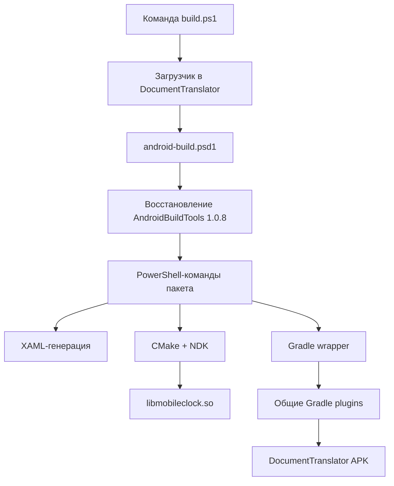

# Как сейчас собирается DocumentTranslator

Этот документ объясняет текущую Android-сборку простыми шагами. Он описывает
состояние после перехода на `AndroidBuildTools 1.0.8`.

## 1. Главная идея

У приложения есть две разные части:

1. **Специфика приложения** — исходники, ресурсы, package ID, CMake targets,
   зависимости, Google Drive-папка.
2. **Повторяющаяся инфраструктура** — поиск SDK/NDK/JDK, CMake-конфигурация,
   вычисление APK-версии, Gradle defaults, подпись, шаблон нового проекта.

Первая часть остаётся в репозитории DocumentTranslator. Вторая живёт в NuGet
пакете `AndroidBuildTools` и подключается по закреплённой версии.

Это похоже на использование общей библиотеки в C++: приложение говорит, *что*
оно собирает, а пакет знает, *как* выполнить типовые части сборки.



## 2. Какие файлы нужно знать в первую очередь

| Файл | За что отвечает |
| --- | --- |
| `build.ps1` | Маленький загрузчик: восстанавливает пакет и передаёт ему команду. |
| `android-build.psd1` | Конфигурация именно DocumentTranslator. |
| `CMakeLists.txt`, `DocumentTranslator.AndroidHost/CMakeLists.txt` | Нативная C++-сборка и её targets. |
| `Tools/Gradle/settings.gradle.kts` | Точка входа Gradle и подключение plugins из пакета. |
| `DocumentTranslator.Android/build.gradle.kts` | Android-специфика приложения. |
| `UtilityHelpersLib/NugetProjects/AndroidBuildTools` | Исходники общего пакета; их не использует приложение напрямую до восстановления пакета. |

## 3. Самый обычный сценарий: Debug APK

В корне DocumentTranslator выполняется:

```powershell
./build.ps1 build-android -Configuration Debug
```

Последовательность следующая.

### Шаг 1. Загрузчик читает конфигурацию

Корневой `build.ps1` сначала читает `android-build.psd1`. В нём записано, что
нужен `AndroidBuildTools 1.0.17` из `C:\NugetFeed`.

Также там описано, например:

```powershell
ArtifactName = 'DocumentTranslator'
AndroidModule = 'DocumentTranslator.Android'
AndroidHost = 'DocumentTranslator.AndroidHost'
NativeLibrary = 'libmobileclock.so'
```

Это не инструкции по сборке. Это данные, которыми пользуются общие инструкции.
Если следующий проект будет называться `SampleApp`, в нём будут другие значения,
но те же scripts и Gradle plugins.

### Шаг 2. Восстанавливается пакет

Если package ещё отсутствует, загрузчик выполняет по сути такую команду:

```powershell
nuget install AndroidBuildTools -Version 1.0.17 `
    -Source C:\NugetFeed `
    -OutputDirectory <PackageDirectories.AndroidBuildTools>
```

Итоговый каталог:

```text
Build/Packages/DocumentTranslator/AndroidBuildTools.1.0.17/
```

Это build output, поэтому он не хранится в Git. Его можно безопасно удалить:
следующий запуск восстановит ровно версию `1.0.17`.

Если временно нужен другой feed, можно не менять Git-файл:

```powershell
$env:ANDROID_BUILD_TOOLS_SOURCE = 'D:\TemporaryNugetFeed'
./build.ps1 build-android -Configuration Debug
```

### Шаг 3. Выполняется команда из пакета

После восстановления загрузчик запускает:

```text
.../AndroidBuildTools.1.0.17/tools/Invoke-Build.ps1
```

Этот файл принимает команду `build-android` и вызывает соответствующий script
из пакета. Поэтому список команд и их параметры обновляются вместе с версией
пакета; корневой `build.ps1` не нужно раз за разом переписывать.

### Шаг 4. Генерируется XAML

У DocumentTranslator есть секция `Xaml` в `android-build.psd1`. Пакет:

1. восстанавливает `XamlRuntime` из NuGet;
2. берёт из него готовый `XamlCompiler.exe`;
3. находит изменённые `.xaml`;
4. создаёт C++-файлы в `!Generated`.

Минимальный Android-проект без XAML не обязан создавать фиктивные каталоги:
если секции `Xaml` нет, этот этап пропускается.

#### Откуда берётся `XamlCompiler.exe`

`XamlCompiler.exe` поставляется внутри NuGet-пакета `XamlRuntime`. Он уже
собран разработчиком `XamlRuntime`; сборка DocumentTranslator не компилирует
его исходники и не зависит от их расположения в `UtilityHelpersLib`.

При Android-команде цепочка такая:

```text
./build.ps1 build-android -Configuration Debug
    ↓
AndroidBuildTools/tools/Invoke-Build.ps1
    ↓
AndroidBuildTools/tools/build-android.ps1
    ↓
AndroidBuildTools/tools/generate-xaml.ps1
    ↓
nuget install XamlRuntime
    ↓
Build/Packages/DocumentTranslator.AndroidHost/XamlRuntime.<версия>/tools/win-x64/XamlCompiler.exe
```

`build-android.ps1` всегда вызывает `generate-xaml.ps1` до CMake-сборки
основного приложения. Тот восстанавливает последнюю доступную версию
`XamlRuntime` из источника, заданного в `PackageSources.Native`. Этот же источник
передаётся CMake при `find_package(XamlRuntime)`.

Каталог задаётся конечным проектом в `PackageDirectories.XamlRuntime`:

```text
Build/Packages/DocumentTranslator.AndroidHost/
```

Это пример текущего DocumentTranslator, а не правило пакета. Другой проект
может указать любой свой относительный путь. AndroidBuildTools получает уже
вычисленный абсолютный каталог и не знает структуры проекта.

Генератор выбирает наиболее новую папку `XamlRuntime.<версия>` с файлом:

```text
tools/win-x64/XamlCompiler.exe
```

После этого тот же `generate-xaml.ps1` вызывает `XamlCompiler.exe` для изменённых
`.xaml`-файлов и получает `.xaml.cpp` и `.xaml.h` в `!Generated`.

У CMake из Visual Studio есть второй вход. При конфигурации target
`DocumentTranslator.AndroidHost` его `CMakeLists.txt` запускает:

```text
build.ps1 generate-xaml
```

Поэтому Visual Studio тоже сначала восстанавливает пакет и использует его
`XamlCompiler.exe`, а уже затем сканирует и компилирует сгенерированные C++-файлы.
Сама логика в обоих сценариях одна: `generate-xaml.ps1` из AndroidBuildTools.

### Шаг 5. CMake собирает native-библиотеку

Пакет находит Visual Studio CMake/Ninja, JDK, Android SDK и NDK. Затем запускает
presets `android-arm64-debug` или `android-arm64-release`.

Результат Android CMake-сборки:

```text
Build/DocumentTranslator.AndroidHost/android/jniLibs/arm64-v8a/libmobileclock.so
```

Gradle не компилирует C++. Он только забирает уже готовую `.so` из этого каталога
и помещает её в APK.

### Шаг 6. Gradle собирает APK

Package запускает wrapper из `Tools/Gradle` примерно так:

```powershell
./gradlew.bat --no-daemon `
    -PappVersionCode=1000000 `
    -PappVersionName=1.0.0 `
    :DocumentTranslator.Android:assembleDebug
```

Для обычного `build-android` номер версии берётся из `version.properties` и
получает patch `.0`. Готовый Debug APK лежит здесь:

```text
Build/DocumentTranslator.Android/outputs/apk/debug/DocumentTranslator.Android-debug.apk
```

## 4. Откуда Gradle берёт общие правила

В обычном Android-проекте большая часть повторяемых настроек часто копируется в
каждый `build.gradle.kts`: SDK-версии, Java version, repositories, build output,
подпись, `buildTypes`. Здесь эта логика вынесена в два Gradle plugins.

`Tools/Gradle/settings.gradle.kts` делает две вещи:

1. вызывает `../../build.ps1 restore`, чтобы узнать путь к восстановленному
   `AndroidBuildTools`;
2. подключает каталог `gradle` из этого пакета как **included build**:

```kotlin
includeBuild("$packageRoot/gradle")
```

Included build — это Gradle-проект, который предоставляет plugins локально.
Его не нужно публиковать в Gradle Plugin Portal: потребитель использует именно
файлы из закреплённого NuGet-пакета.

После этого становятся доступны два ID:

```kotlin
id("com.isrepeat.android.settings")
id("com.isrepeat.android.application")
```

### `com.isrepeat.android.settings`

Этот plugin применяется в `settings.gradle.kts`. Он настраивает источники,
откуда Gradle будет скачивать зависимости.

Порядок источников библиотек:

1. локальный Maven feed `C:/!PackagesFeed/Android`;
2. Google Maven;
3. Maven Central.

Локальный путь можно изменить без правки проекта:

```powershell
./gradlew.bat -PandroidMavenSource=D:/AndroidFeed :DocumentTranslator.Android:assembleDebug
```

или переменной окружения:

```powershell
$env:ANDROID_MAVEN_SOURCE = 'D:\AndroidFeed'
```

Plugin также задаёт `FAIL_ON_PROJECT_REPOS`. Это значит: если какой-либо Android
модуль попробует незаметно добавить собственный repository, Gradle завершится
ошибкой. Так все модули используют одни и те же правила получения зависимостей.

### `com.isrepeat.android.application`

Этот plugin применяется в `DocumentTranslator.Android/build.gradle.kts`.
Он сначала подключает официальный Android Gradle Plugin (`com.android.application`),
а затем задаёт общие настройки:

| Настройка | Значение сейчас |
| --- | --- |
| `compileSdk`, `targetSdk` | 36 |
| `minSdk` | 24 |
| ABI | `arm64-v8a` |
| Java source/target | 11 |
| Kotlin JVM target | наследуется от Java в AGP 9 |
| Общие зависимости | AndroidX Activity и Lifecycle |
| Каталог build output | `Build/<имя Gradle-модуля>` |
| Release optimization | выключена |

Он также передаёт `versionCode` и `versionName`, настраивает правила подписи и
отключает долгий cache динамических версий Maven, например `androidappkit:+`.

Важно: plugin задаёт основу. Файл приложения добавляет то, что не может быть
общим:

```kotlin
android {
    namespace = "com.isrepeat.documenttranslator"
    defaultConfig.applicationId = "com.isrepeat.documenttranslator"
    sourceSets {
        getByName("main").assets.directories += "../DocumentTranslator.Application/Resources"
        getByName("main").jniLibs.directories +=
            "../Build/DocumentTranslator.AndroidHost/android/jniLibs"
    }
}
```

То есть `namespace`, `applicationId`, ресурсы и native `.so` остаются в
DocumentTranslator, потому что это его данные.

## 5. Версии: обычная сборка и distribution APK

`version.properties` — базовая версия:

```properties
VERSION_CODE_BASE=1000000
VERSION_NAME_BASE=1.0
```

Правило такое:

```text
versionName = major.minor.patch
versionCode = major * 1 000 000 + minor * 1 000 + patch
```

Например, для `1.0.7` это `1000007`.

Команда:

```powershell
./build.ps1 build-and-distribute -Destination Local -Configuration Release
```

ищет предыдущие APK вида `DocumentTranslator-1.0.*.apk` в
`Build/distribution`, выбирает следующий patch, передаёт его CMake и Gradle,
а потом копирует APK сюда:

```text
Build/distribution/DocumentTranslator-1.0.7.apk
```

`version.properties` при этом не меняется. Значит, рабочее дерево не получает
изменение после обычного релиза, а номер release определяется уже существующими
APK в distribution-каталоге.

Для повторной установки той же версии есть:

```powershell
./build.ps1 build-and-distribute -Destination Local -KeepVersion
```

## 6. Debug, Release и подпись

Debug собирается с обычным debug keystore Android и не нуждается в секретах.

Release требует внешний properties-файл с такими полями:

```properties
storeFile=C:/path/to/release.jks
storePassword=...
keyAlias=...
keyPassword=...
```

В DocumentTranslator путь передан через `Tools/Gradle/gradle.properties`:

```properties
androidSigningProperties=C:/WORK/Secrets/isrepeat-android-release.properties
```

Вместо этого можно задать переменную окружения:

```powershell
$env:ANDROID_SIGNING_PROPERTIES = 'D:\Secrets\release.properties'
```

Если Release key не настроен, задача `verifyReleaseSigning` останавливает
Release до упаковки APK. Debug от этого не страдает. Сам ключ и пароли не
попадают ни в Git, ни в NuGet-пакет.

## 7. CMake из Visual Studio и previewer

Visual Studio использует `CMakePresets.json`. Android presets подключают
`cmake/AndroidToolchain.cmake`, а он тоже выполняет `build.ps1 restore`.
Поэтому CMake из IDE получает ту же версию общих CMake-модулей, что и
PowerShell-сборка.

Desktop preset не использует Android NDK. Но корневой `CMakeLists.txt` всё равно
восстанавливает пакет, чтобы общие модули могли найти `XamlRuntime` и SDK
previewer-а.

Проверить previewer без открытия окна:

```powershell
./build.ps1 run-android-app-previewer -Configuration Debug -BuildOnly
```

Он собирает DLL плагина DocumentTranslator и WPF-хост AndroidAppPreviewer.

## 8. Google Drive

Команда:

```powershell
./build.ps1 build-and-distribute -Destination Drive -Configuration Release
```

сначала делает всё то же, что `-Destination Local`, затем загружает готовый APK
в путь `Android/DocumentTranslator` на Google Drive. Путь и файлы OAuth лежат в
секции `Drive` файла `android-build.psd1`; сами секреты хранятся вне репозитория.

Отдельно можно загрузить уже собранный APK:

```powershell
./build.ps1 upload-apk-to-drive -ApkPath C:\Temp\DocumentTranslator.apk
```

## 9. Что менять для нового приложения

Для нового приложения можно использовать generator из восстановленного пакета:

```powershell
$tools = ./build.ps1 restore
& "$tools/tools/New-AndroidApplication.ps1" `
    -Name SampleApp `
    -PackageId com.example.sampleapp `
    -Destination C:\Projects\SampleApp `
    -BuildToolsSource C:\NugetFeed `
    -NativePackageSource C:\NugetFeed
```

Он создаёт минимальный Git-каркас с wrapper Gradle, Java Activity, JNI-библиотекой
и `android-build.psd1`. После этого базовая проверка выглядит так:

```powershell
cd C:\Projects\SampleApp
./build.ps1 build-android -Configuration Debug
```

Дальше в новом проекте обычно меняются только:

1. `android-build.psd1` — имена, пути, XAML, Drive и previewer при необходимости;
2. CMake targets и C++-код;
3. Android sources, manifest, resources и зависимости;
4. `applicationId` и `namespace`.

Не нужно копировать из DocumentTranslator scripts поиска SDK, вычисления APK
версии, Gradle repository rules, wrapper bootstrap или общие CMake-модули.

## 10. Короткая памятка команд

| Задача | Команда |
| --- | --- |
| Собрать Debug APK | `./build.ps1 build-android -Configuration Debug` |
| Собрать Release APK | `./build.ps1 build-android -Configuration Release` |
| Собрать только C++ `.so` | `./build.ps1 build-android -NativeOnly` |
| Полностью переconfigure CMake | `./build.ps1 build-android -Clean` |
| Сделать локальный versioned release | `./build.ps1 build-and-distribute -Destination Local -Configuration Release` |
| Повторить последний release version | `./build.ps1 build-and-distribute -Destination Local -KeepVersion` |
| Собрать previewer без окна | `./build.ps1 run-android-app-previewer -BuildOnly` |
| Узнать путь пакета | `./build.ps1 restore` |

## 11. Как отлаживать проблему

Начинать лучше с самого раннего слоя.

1. Не восстановился пакет — проверить `BuildToolsVersion`, `BuildToolsSource`,
   наличие `nuget.exe` и `C:\NugetFeed`.
2. Не работает native-сборка — выполнить `-NativeOnly` и смотреть CMake/NDK.
3. C++ собрался, APK нет — проблема уже в Gradle, dependencies или Android code.
4. Не собирается Release — проверить `androidSigningProperties` и keystore.
5. Не найдено приложение previewer-а — проверить `Preview.Root` в
   `android-build.psd1`.

Так не приходится одновременно разбирать PowerShell, CMake и Gradle: каждый
следующий слой запускается только после успешного предыдущего.